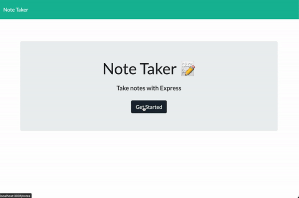

 <h1 id="project-title">makenotesnotwar</h1>
 
<!--  -->

<h2 id="table-contents">Table of Contents</h2>

-[Description](#project-desc)

-[See it Live](#project-tech)

-[Screen Captures](#project-captures)

-[Technology](#project-tech)

-[Installation](#project-inst)

-[Usage](#project-usage)

-[Questions/Contact](#project-contact)

<!-- -[References](#project-ref) -->

<h2 id="project-desc">Description</h2>

<a href="#project-title">Back to Top</a>

<h2 id="project-live">See it in action!</h2>

[See it live](https://aqueous-forest-83707.herokuapp.com/)

<h2 id="project-captures">Screen captures</h2>

| Image | Description |
| --- | ----------- |
|   | Application in use |

<h2 id="project-tech">Technology</h2>

- Node.js
- Express.js

<a href="#project-title">Back to Top</a>

<h2 id="project-inst">Installation</h2>

To install Inquirer.js, run the following command in your local directory

    `npm i`

<a href="#project-title">Back to Top</a>

<h2 id="project-usage">Usage</h2>
Recommended prerequisites include node.js version 16.2.0 or later. To execute the program run the following command in your local directory

    `node server.js`

<a href="#project-title">Back to Top</a>

<!-- <h2 id="project-ref">References</h2> -->

<!-- 
<a href="#project-title">Back to Top</a>
 -->

<h2 id="project-contact">Questions / Contact</h2>

- [See more of my work on GitHub](https://github.com/mcjbyday) 

<a href="#project-title">Back to Top</a>

